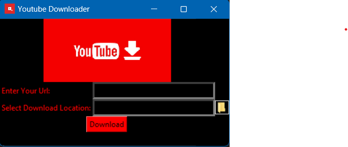

# YouTube Video Downloader

YouTube Video Downloader is a Python application with a simple and user-friendly interface that allows you to easily download YouTube videos.

## How to Use

1. Clone the project to your computer or download it as a zip file.

2. Python 3 must be installed. If it's not installed, you can download it from the [Python download page](https://www.python.org/downloads/).

3. Install the required Python libraries using the following command:

pip install pytube pillow

4. Run the application by executing the `youtube_downloader.py` file.

5. Paste the YouTube video URL into the "Enter Your Url" field.

6. Specify the download location by either using the "Select Download Location" button or entering it manually.

7. Click the "Download" button to start the video download.

## Screenshot

---

**Note:** This application is developed for educational purposes only, and it's important to comply with YouTube's terms of service. Any copyright infringement is the responsibility of the user.

If you would like to contribute to the development of the project, please feel free to submit a pull request or report any issues.
